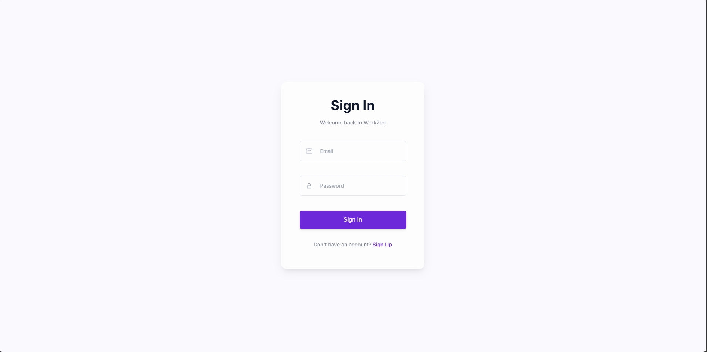
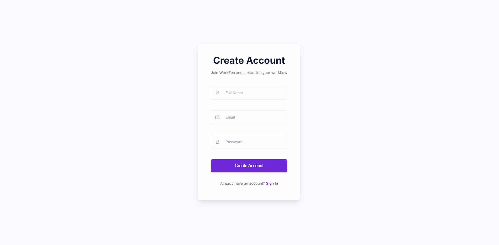
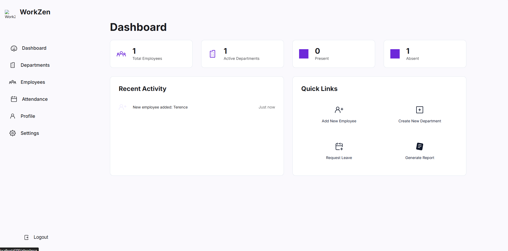

# Employee Management System

A full-stack employee management application built with Angular frontend and Spring Boot backend, featuring user authentication, employee management, department management, and attendance tracking.

## [SCREENSHOTS] Application Interface

| Interface | Description |
|-----------|-------------|
|  | **Sign-in Page** - User authentication interface |
|  | **Register Page** - New user registration |
|  | **Dashboard** - Main application interface |

## [FEATURES] Key Functionality

- **User Authentication** - Secure login and registration system
- **Employee Management** - Add, edit, delete, and view employee records
- **Department Management** - Organize employees by departments
- **Attendance Tracking** - Monitor employee attendance
- **Responsive Design** - Modern UI with Angular Material and Tailwind CSS
- **RESTful API** - Spring Boot backend with comprehensive API documentation

## [TECH STACK] Technology Stack

### Frontend
- **Angular 20.2.0** - Modern TypeScript framework
- **Angular Material 20.2.1** - UI component library
- **Tailwind CSS 3.4.17** - Utility-first CSS framework
- **GSAP 3.13.0** - Animation library
- **RxJS 7.8.0** - Reactive programming

### Backend
- **Spring Boot 3.5.5** - Java application framework
- **Spring Security** - Authentication and authorization
- **Spring Data JPA** - Data persistence
- **MySQL** - Primary database
- **H2 Database** - Development/testing database
- **Swagger/OpenAPI** - API documentation
- **Lombok** - Java code generator
- **Maven** - Build tool

## [REQUIREMENTS] Prerequisites

- **Node.js** (v18 or higher)
- **npm** or **yarn**
- **Java 17** or higher
- **Maven 3.6+**
- **MySQL 8+**

## [SETUP] Installation & Setup

### Database Setup
1. Install MySQL
2. Create database:
   ```sql
   CREATE DATABASE workzen;
   ```
3. Update database credentials in `backend/src/main/resources/application.properties`

### Backend Setup
```bash
cd backend
mvn clean install
mvn spring-boot:run
```

The backend will start on `http://localhost:8080`

### Frontend Setup
```bash
cd frontend
npm install
npm start
```

The frontend will start on `http://localhost:4200`

## [API DOCS] API Documentation

Once the backend is running, access the Swagger UI at:
- **Swagger UI**: `http://localhost:8080/swagger-ui.html`
- **API Docs**: `http://localhost:8080/api-docs`

## [STRUCTURE] Project Structure

```
Employee_management/
├── backend/                 # Spring Boot backend
│   ├── src/main/java/com/workzen/backend/
│   │   ├── component/       # Utility components
│   │   ├── config/          # Configuration classes
│   │   ├── controller/      # REST controllers
│   │   ├── dto/             # Data Transfer Objects
│   │   ├── entity/          # JPA entities
│   │   └── repository/      # Data repositories
│   ├── src/main/resources/
│   │   └── application.properties
│   └── pom.xml
├── frontend/                # Angular frontend
│   ├── src/app/
│   │   ├── auth/            # Authentication components
│   │   ├── dashboard/       # Dashboard component
│   │   ├── departments/     # Department management
│   │   ├── employees/       # Employee management
│   │   ├── attendance/      # Attendance tracking
│   │   └── ...
│   ├── angular.json
│   └── package.json
├── Screenshot/              # Application screenshots
└── mysql-data/           # MySQL data directory
```

## [AUTH] Authentication

The application uses JWT-based authentication:
- Register new users through the registration page
- Login with email and password
- JWT tokens are used for API authorization
- Protected routes require authentication

## [API] API Endpoints

### Authentication
- `POST /api/auth/login` - User login
- `POST /api/auth/register` - User registration

### Employees
- `GET /api/employees` - Get all employees
- `POST /api/employees` - Create new employee
- `PUT /api/employees/{id}` - Update employee
- `DELETE /api/employees/{id}` - Delete employee

### Departments
- `GET /api/departments` - Get all departments
- `POST /api/departments` - Create new department

### Attendance
- `GET /api/attendance` - Get attendance records
- `POST /api/attendance` - Record attendance

## [UI] UI Features

- **Responsive Design** - Works on desktop and mobile devices
- **Dark/Light Theme** - Toggle between themes
- **Modern Interface** - Clean and intuitive design
- **Form Validation** - Client-side and server-side validation
- **Loading States** - Visual feedback for user actions

## [SECURITY] Security Features

- **Spring Security** - Comprehensive security configuration
- **CORS Protection** - Cross-origin request handling
- **JWT Authentication** - Secure token-based authentication
- **Input Validation** - Protection against malicious input
- **Password Encryption** - Secure password storage

## [RESPONSIVE] Responsive Design

The application is fully responsive and works across:
- Desktop computers
- Tablets
- Mobile devices

## [TESTING] Testing

### Backend Testing
```bash
cd backend
mvn test
```

### Frontend Testing
```bash
cd frontend
npm test
```

## [DEPLOY] Production Deployment

### Backend
```bash
cd backend
mvn clean package
java -jar target/workzen-backend-0.0.1-SNAPSHOT.jar
```

### Frontend
```bash
cd frontend
npm run build
# Serve the dist/ folder with a web server
```

## [CONTRIBUTE] Contributing

1. Fork the repository
2. Create a feature branch
3. Commit your changes
4. Push to the branch
5. Create a Pull Request

## [LICENSE] License

This project is licensed under the MIT License.

## [TEAM] Team

Developed as part of the WorkZen Employee Management System project.

## [SUPPORT] Support

For support and questions, please create an issue in the repository.

---

**Note**: This is a full-stack application demonstrating modern web development practices with Angular and Spring Boot.
